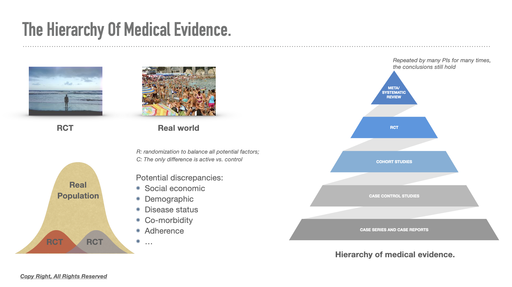

```{r setup, include=FALSE}
knitr::opts_chunk$set(message = F, 
                      warning = F,
                      cache = T,
                      fig.retina = 2,
                      fig.width = 8,
                      fig.asp = .618,
                      fig.align = "center")
```

```{r Packages., include=FALSE}
library(tidyverse)
library(lubridate)
library(readxl)
library(lme4)
library(sjPlot)
library(glmmTMB)
library(doParallel)
library(scales)
library(patchwork)
```

```{r Initiate parallel processing, include=FALSE}
all_cores <- detectCores(logical = FALSE)

registerDoParallel(cores = all_cores)
```


```{r Helper functions, include=FALSE}
# Read all excel sheets. 
source("excel_all_sheets.R")
```


```{r year name, include=FALSE}
year <- 2012:2020
```

```{r Read data, include=FALSE}
# Read 9 excel sheets and return 9 data frames.  
my_dat <- read_excel_allsheets(filename = 'data/raw.xlsx')

# For each data frame
# Loop to change wide format to wide
# Combine data by year. 
total <- data.frame()

for (i in 1:length(my_dat)) {
    
    # Label year for each data frame
    my_dat[[i]]$year <- year[i]
    
    # Fill each row with HIS id. 
    # A vector
    l <- vector()
    # Loop to fill HIS. 
    for (j in 1:nrow(my_dat[[i]])) {
        if(!is.na(my_dat[[i]]$`患者His号（完整10位数）`[j])){
            l[j] = my_dat[[i]]$`患者His号（完整10位数）`[j]
            }else{
                l[j] = l[j-1]
            }
    }
    
    # New HIS id and remove old HIS
    my_dat[[i]]$HIS_new<-l

    # pt info table
    # Col 2-9 as pt info. 
    # Col ncol(df) as row-filled HIS id. 
    pt_info <- my_dat[[i]][, c(2:9, ncol(my_dat[[i]]))]
    # Remove rows of all NAs. 
    pt_info <- pt_info %>%
        filter_all(any_vars(!is.na(.)))
    
    #Column rename of pt info
    colnames(pt_info) <- c("Gender", "Age", "HIS",
                           "Doctor", "ICD", "Dx",
                           "In-Patient", "Follow_up", "HIS_new")
    
    # Cols from col 10 as data
    # Data labeled with HIS id.
    # Col 4: HIS ID
    # Col 10 to end: data and date
    pt_data <- my_dat[[i]][, c(10:ncol(my_dat[[i]]))]
    # HIS_new as first column
    pt_data <- pt_data %>%
        select(HIS_new, everything())

    # Rearrange each pt_data to long format
    dat <- data.frame()
    for(k in 1:((ncol(pt_data)-1)/2)) {
        if(2*k + 1 <= ncol(pt_data)) {
            tmp <- pt_data[, c(1, (2*k):(2*k + 1), ncol(pt_data))]
            tmp$name <- colnames(tmp)[2]
            colnames(tmp)[2:3] <- c("data", "date")
            dat <- rbind(dat, tmp)
        }
    }
    # In each year
    # Join dat (long format pts data)
    # With pt_info
    dat <- dat %>%
        right_join(pt_info, by = "HIS_new")
    
    # Combine data of 9 years
    total <- rbind(total, dat)
}
```

```{r Data cleaning, include=FALSE}
# Date format
total$date <- ymd(total$date)
# Remove old HIS id. 
total <- total %>%
    select(-HIS)
# Remove NAs of redudant pt_info
total <- total %>%
    filter(!is.na(Gender) & 
               !is.na(Age) &
               !is.na(Doctor))
# Remove 'doctor', 'Follow_up' columns
# All entries in 'Follow_up' is high
total <- total %>%
    select(-Doctor, -Follow_up)

# Drop NAs
total <- total %>%
    filter(!is.na(data))
# Remove repeated entries. 
total <- distinct(total)
```

```{r Correct the age, include=FALSE}
# Age is kept as the CURRENT 2020 age
# for Age in 2019, need to minus 1. 
# For each HIS id, get the year change from a year to 2020
total$year_change <- 2020 - total$year
# Substract Age 2020 with year change. 
total$Age <- total$Age - total$year_change
```

```{r Consolidate ICD entries, eval=FALSE, include=FALSE}
#Consolidate ICD code
#icd <- table(total$ICD)
#write.csv(icd, "icd.csv")
```


```{r Outlier removal TG, include=FALSE}
outlier <- total %>%
    filter(HIS_new %in% "0000373621" & 
               name %in% "甘油三酯" & 
               year %in% "year2020")

total[total$HIS_new == "0000373621" & 
               total$name == "甘油三酯" & 
               total$year == 2020 & 
          total$data == 22.29, ]$data <- median(outlier$data)
```

```{r Outlier removal Creatine, include=FALSE}
outlier <- total %>%
    filter((HIS_new %in% "0005316026") & 
               name %in% "血清肌酐" & 
               year %in% 2013) %>%
    arrange(desc(data))

total[total$HIS_new == "0005316026" & 
               total$name == "血清肌酐" & 
               total$year == 2013 & 
          total$data == 25938.0, ]$data <- median(outlier$data)

outlier <- total %>%
    filter((HIS_new %in% "0000701411") & 
               name %in% "血清肌酐" & 
               year %in% 2013) %>%
    arrange(desc(data))

total[total$HIS_new == "0000701411" & 
               total$name == "血清肌酐" & 
               total$year == 2013 & 
          total$data == 23239.0, ]$data <- median(outlier$data)

outlier <- total %>%
    filter((HIS_new %in% "0005922995") & 
               name %in% "血清肌酐" & 
               year %in% 2015) %>%
    arrange(desc(data))


total[total$HIS_new == "0005922995" & 
               total$name == "血清肌酐" & 
               total$year == 2015 & 
          total$data == 1997.0, ]$data <- median(outlier$data)
```

## 目标

1. 数据准备：对2012-2020的样本数据进行汇总和数据管理；

2. 数据探索：关键指标与CKD的疾病管理质量；

3. 统计与建模；

4. 高维数据的降维表征探索。

## 数据管理的步骤

1. 分年度读取；

2. 转化为机器可读取的表单形式；

3. 重新计算患者分分年年龄；

4. 异常值的检查和中位数插值：
    
    - 0000373621, 0005316026, 0000701411, 0005922995

## eGFR的计算

原始数据仅在2020年开始记录eGFR，中国改良MRDR公式：

男性eGFR计算公式：

$$
eGFR_{male} = 186 \times SCr^{-1.154}\times Age^{-0.203} 
$$

女性eGFR计算公式：

$$
eGFR_{female} = 186 \times SCr^{-1.154}\times Age^{-0.203} \times{0.742}
$$

```{r Calculate eGFR, include=FALSE}
# Select all creatine 
cr <- total %>%
  filter(name %in% "血清肌酐")
# eGFR function based on modified MDRD in China
# Formula above. 
eGFR <- function(data = cr) {
  if(cr$Gender %in% "男") {
    # male formula
    eGFR <- 88.41 * 186 * (cr$data)^(-1.154) * (cr$Age)^(-0.203)
  }else{
    # female formula
    eGFR <- 88.41 * 186 * (cr$data)^(-1.154 )* (cr$Age)^(-0.203) * 0.742
  }
}

cr$name <- "eGFR"
cr$data <- eGFR(data = cr)

# row combine of cr to total
# eGFR as data in column 'name'. 
total <- rbind(total, cr)

# Remove eGFR in raw data, 
# which is missed for most cases. 
total <- total %>%
  filter(! name %in% "估算肾小球滤过率")
```

```{r remove BP and weight, include=FALSE}
# BP weight data only available in 2020
# Excluded from longitudinal analysis
# Included in 2020 cross-sectional analysis. 
# Longi_total as data set for longitudinal analysis. 
longi_total <- total %>%
    filter(!name %in% "收缩压" &
               !name %in% "舒张压" &
               !name %in% "体重")
```

```{r annual mean by metrics, include=FALSE}
# For each HIS id, 
# Calculate the annual mean of each metric
annual_mean <- longi_total %>%
    group_by(HIS_new, year, name) %>%
    summarise(mu = mean(data, na.rm = TRUE)) %>%
  ungroup()
```

## 数据清洗后的全部数据集可视化

```{r Plot annual mean, echo=FALSE}
theme <- theme_get()
#using the Chinese fonts you have, check it with font book.  
theme$text$family <- "STFangsong"
theme_set(theme)

# For each HIS id, 
# Plot the annual mean of each metric
# Facet by metric. 

m_units <- data.frame(
  name = unique(annual_mean$name),
  units = c("mmol/L", "umol/L", "g/L", 
            "g/L", "umol/L", "mL/min/1.73m2")
)

annual_mean <- annual_mean %>%
  left_join(m_units, by = "name") %>%
  mutate(new_name = paste0(name, "（", units, "）"))

ggplot(annual_mean) + 
    geom_line(aes(x = year, y = mu, 
                  colour = name, 
                  group = HIS_new), 
              size = 0.3,
              alpha = .5) + 
  guides(colour = FALSE) + 
  scale_color_viridis_d(option = "D", 
                        begin = 0.2) + 
  facet_wrap(new_name~.,scales = "free_y", 
             strip.position = "left")  + 
  theme(strip.background = element_blank(),
        strip.placement = "outside",
        legend.position="bottom" ) + 
  labs(title = "所有病例的年度关键指标")
```

收缩压、舒张压仅有2020年数据，在纵向数据分析时被去除。

## ICD 编码

原始数据的ICD编码： 

```{r echo=FALSE}
# Read ICD.xlsx
icd <- read_excel("icd.xlsx")
knitr::kable(head(icd,10))
```

处理策略：

1. 去除症状相关编码--大多数病例没有给出症状相关编码；

2. 合并所有红斑狼疮相关；

3. 去除所有CKD分期相关的ICD代码--和病因编码有重叠，每个病例在每个时间点的CKD分期通过计算eGFR获得。

```{r include=FALSE}
# Select two columns
icd <- icd[, c(2:3)]

# Select total data in 2020
# Only 2020 data has ICD entries
total_2020 <- total %>%
  filter(year %in% 2020)

# Join icd with total_2020
# In total_2020: use column 'ICD'; 
# In icd, use column 'RAW'. 
total_2020 <- total_2020 %>%
  left_join(icd)

# Select HIS_new and new_icd columns
# This is a unified icd diagnosis for each patient in each year
icd <- total_2020 %>%
  select(HIS_new, NewICD)

# Join ICD with total dataset
total <- total %>%
  left_join(icd, by = "HIS_new")

# Drop NAs in NewICD
total <- total %>%
  filter(! is.na(NewICD))

# Remove column 'ICD', 'Dx', 'year_change'
total <- total %>%
  select(-ICD, -Dx, -year_change)
```

## 基于ICD病因分类的eGFR

```{r echo=FALSE}
# Subset to get all eGFR
egfr <- total %>%
  filter(name %in% "eGFR")

egfr <- distinct(egfr)

# Select HIS_new, data and date
egfr <- egfr %>%
  select(HIS_new, data, date)

# Join egfr by HIS_new and date
# With total
total <- merge(total, egfr, by.x = c("HIS_new", "date"), 
               by.y = c("HIS_new", "date"))
# eGFR as a column variable. 
# Notice eGFR also as data in column 'data'. 

# Rename 'total'. 
colnames(total) <- c("HIS_new", "date", "data", "year", 
                     "name", "Gender", "Age", "In-Patient", 
                     "NewICD", "eGFR")

# CKD stage by eGFR. 
total$stage <- cut(total$eGFR, 
                   breaks = c(0, 15, 29, 59, 89, 2000), 
                   labels = c("ESRD", "CKD4", "CKD3", 
                              "CKD2", "Normal"))

total %>%
  filter(name %in% "eGFR") %>%
  distinct() %>%
  filter(! NewICD %in% "CKD1" &
           ! NewICD %in% "CKD2" &
           ! NewICD %in% "CKD3"&
           ! NewICD %in% "CKD4") %>%
  ggplot() + 
  geom_line(aes(x = date, y = data, 
                colour = NewICD, 
                group = HIS_new),
            alpha = 0.5) + 
  scale_color_viridis_d(option = "D",
                        begin = 0.2) + 
  facet_grid(NewICD~.)

```

由于样本量原因，进一步去除糖尿病肾病、膜性肾病和肾病综合征的病例。

## 指标达标率的计算思考

不同CKD分期的患者的指标管理难度不同；

需要按照CKD分期计算指标的达标率；

有患者在一年内根据eGFR水平在不同CDK分期之间转化；

同一患者可能出现重复计算--在同一年该患者即被计入CKD2的计算、也被计入CKD3的计算；

达标率读取注意小样本偏差。

## 指标达标率

```{r echo=FALSE}
tmp <- read_csv("data/normal.csv")
knitr::kable(tmp[c(1, 5, 8, 9, 12, 13), c(2, 3, 5, 6)])
```


## 指标达标率
### 甘油三酯

```{r Normal table., include=FALSE}
# Read normal table. 
normal <- read_csv("data/normal.csv")
metric_CHN <- c("白蛋白", "血磷", "C-反应蛋白",
                "总胆固醇", "甘油三酯", "低密度脂蛋白",
                "高密度脂蛋白", "尿酸-男性", "尿酸-女性",
                "收缩压", "舒张压", "血红蛋白-男性", "血红蛋白-女性")
# Assign metric in Chinese
normal$metric_CHN <- metric_CHN
# Remove a column. 
normal<- normal[, -1]
```

```{r include=FALSE}
m <- c("甘油三酯", "尿酸", "血红蛋白", "白蛋白")
```


```{r triglyceride TG, echo=FALSE}
# Select normal table triglyceride. 
normal_tmp <- normal %>%
  filter(str_detect(metric_CHN, m[1]))
# Subset TG from total
total_tmp <- total %>%
  filter(str_detect(name, m[1])) %>%
  # Remove repeated rows. 
  distinct() %>%
  # For each case;
  # Calculate the mean TG in that year. 
  group_by(HIS_new, year, stage) %>%
  summarise(mu = mean(data))

# Cut label by the normal table
total_tmp$target <- cut(total_tmp$mu, 
                        breaks = c(normal_tmp[1, 3], 
                                   normal_tmp[1, 4], 
                                   normal_tmp[1, 5],
                                   normal_tmp[1, 6]), 
                        labels = c("Low", "Normal", "High"))

tmp_test <- total_tmp %>%
  group_by(year, stage, target) %>%
  summarise(n = n()) %>%
  mutate(n_sum = sum(n)) %>%
  mutate(pct = n/sum(n)) %>%
  drop_na() %>%
  filter(target %in% "Normal")

ggplot(tmp_test, aes(x = factor(year), 
               y = pct)) + 
  geom_line(aes(group = stage, 
               colour = stage), 
            size = 4, 
            alpha = 0.8)+ 
  geom_point(colour = "grey", 
             size = 3) + 
  geom_text(aes(label = percent(pct, 2), 
                colour = stage), 
            vjust = -0.5,
            show.legend = FALSE) + 
  geom_text(aes(x = factor(year), y = 0.05, label = n_sum), 
            size = 3, 
            colour = "grey1") + 
  coord_cartesian(ylim = c(0, 0.5)) + 
  scale_y_continuous(breaks = c(0, 0.2, 0.4), 
                     labels = percent_format(1)) + 
  facet_grid(stage~.) + 
  scale_color_viridis_d(option = "D", 
                        begin = 0.2, 
                        end = 0.8) + 
  labs(x = "Year", y = "Percentage %", 
       title = "On-target rate of triglyceride by CKD stage.") +
  theme(panel.grid.minor = element_blank())
```

## 指标达标率

### 男性尿酸

```{r UA male, echo=FALSE}
# Select normal table triglyceride. 
normal_tmp <- normal %>%
  filter(str_detect(metric_CHN, m[2]))
# Subset TG from total
total_tmp <- total %>%
  filter(str_detect(name, m[2])) %>%
  filter(Gender %in% "男") %>%
  # Remove repeated rows. 
  distinct() %>%
  # For each case;
  # Calculate the mean TG in that year. 
  group_by(HIS_new, year, stage) %>%
  summarise(mu = mean(data))

# Cut label by the normal table
total_tmp$target <- cut(total_tmp$mu, 
                        breaks = c(normal_tmp[1, 3], 
                                   normal_tmp[1, 4], 
                                   normal_tmp[1, 5],
                                   normal_tmp[1, 6]), 
                        labels = c("Low", "Normal", "High"))

tmp_test <- total_tmp %>%
  group_by(year, stage, target) %>%
  summarise(n = n()) %>%
  mutate(n_sum = sum(n)) %>%
  mutate(pct = n/sum(n)) %>%
  drop_na() %>%
  filter(target %in% "Normal")

ggplot(tmp_test, aes(x = factor(year), 
               y = pct)) + 
  geom_line(aes(group = stage, 
               colour = stage), 
            size = 4, 
            alpha = 0.8)+ 
  geom_point(colour = "grey", 
             size = 3) + 
  geom_text(aes(label = percent(pct, 2), 
                colour = stage), 
            vjust = 1.5,
            show.legend = FALSE) + 
  geom_text(aes(x = factor(year), y = 0.05, label = n_sum), 
            size = 3, 
            colour = "grey1") + 
  coord_cartesian(ylim = c(0, 1)) + 
  scale_y_continuous(breaks = c(0, 0.2, 0.4, 0.6, 0.8, 1), 
                     labels = percent_format(1)) + 
  facet_grid(stage~.) + 
  scale_color_viridis_d(option = "D", 
                        begin = 0.2, 
                        end = 0.8) + 
  labs(x = "Year", y = "Percentage %", 
       title = "On-target rate of uric acid of male by CKD stage.") +
  theme(panel.grid.minor = element_blank())
```

## 指标达标率

### 女性尿酸

```{r UA female, echo=FALSE}
# Select normal table triglyceride. 
normal_tmp <- normal %>%
  filter(str_detect(metric_CHN, m[2]))
# Subset TG from total
total_tmp <- total %>%
  filter(str_detect(name, m[2])) %>%
  filter(Gender %in% "女") %>%
  # Remove repeated rows. 
  distinct() %>%
  # For each case;
  # Calculate the mean TG in that year. 
  group_by(HIS_new, year, stage) %>%
  summarise(mu = mean(data))

# Cut label by the normal table
total_tmp$target <- cut(total_tmp$mu, 
                        breaks = c(normal_tmp[2, 3], 
                                   normal_tmp[2, 4], 
                                   normal_tmp[2, 5],
                                   normal_tmp[2, 6]), 
                        labels = c("Low", "Normal", "High"))

tmp_test <- total_tmp %>%
  group_by(year, stage, target) %>%
  summarise(n = n()) %>%
  mutate(n_sum = sum(n)) %>%
  mutate(pct = n/sum(n)) %>%
  drop_na() %>%
  filter(target %in% "Normal")

ggplot(tmp_test, aes(x = factor(year), 
               y = pct)) + 
  geom_line(aes(group = stage, 
               colour = stage), 
            size = 4, 
            alpha = 0.8)+ 
  geom_point(colour = "grey", 
             size = 3) + 
  geom_text(aes(label = percent(pct, 2), 
                colour = stage), 
            vjust = 1.5,
            show.legend = FALSE) + 
  geom_text(aes(x = factor(year), y = 0.05, label = n_sum), 
            size = 3, 
            colour = "grey1") + 
  coord_cartesian(ylim = c(0, 1)) + 
  scale_y_continuous(breaks = c(0, 0.2, 0.4, 0.6, 0.8, 1), 
                     labels = percent_format(1)) + 
  facet_grid(stage~.) + 
  scale_color_viridis_d(option = "D", 
                        begin = 0.2, 
                        end = 0.8) + 
  labs(x = "Year", y = "Percentage %", 
       title = "On-target rate of uric acid of female by CKD stage.") +
  theme(panel.grid.minor = element_blank())
```

## 指标达标率

### 男性血红蛋白

```{r Hb male, echo=FALSE}
# Select normal table triglyceride. 
normal_tmp <- normal %>%
  filter(str_detect(metric_CHN, m[3]))
# Subset TG from total
total_tmp <- total %>%
  filter(str_detect(name, m[3])) %>%
  filter(Gender %in% "男") %>%
  # Remove repeated rows. 
  distinct() %>%
  # For each case;
  # Calculate the mean TG in that year. 
  group_by(HIS_new, year, stage) %>%
  summarise(mu = mean(data))

# Cut label by the normal table
total_tmp$target <- cut(total_tmp$mu, 
                        breaks = c(normal_tmp[1, 3], 
                                   normal_tmp[1, 4], 
                                   normal_tmp[1, 5],
                                   normal_tmp[1, 6]), 
                        labels = c("Low", "Normal", "High"))

tmp_test <- total_tmp %>%
  group_by(year, stage, target) %>%
  summarise(n = n()) %>%
  mutate(n_sum = sum(n)) %>%
  mutate(pct = n/sum(n)) %>%
  drop_na() %>%
  filter(target %in% "Normal")

ggplot(tmp_test, aes(x = factor(year), 
               y = pct)) + 
  geom_line(aes(group = stage, 
               colour = stage), 
            size = 4, 
            alpha = 0.8)+ 
  geom_point(colour = "grey", 
             size = 3) + 
  geom_text(aes(label = percent(pct, 2), 
                colour = stage), 
            vjust = 1.5,
            show.legend = FALSE) + 
  geom_text(aes(x = factor(year), y = 0.05, label = n_sum), 
            size = 3, 
            colour = "grey1") + 
  coord_cartesian(ylim = c(0, 1)) + 
  scale_y_continuous(breaks = c(0, 0.2, 0.4, 0.6, 0.8, 1), 
                     labels = percent_format(1)) + 
  facet_grid(stage~.) + 
  scale_color_viridis_d(option = "D", 
                        begin = 0.2, 
                        end = 0.8) + 
  labs(x = "Year", y = "Percentage %", 
       title = "On-target rate of homoglobin of male by CKD stage.") +
  theme(panel.grid.minor = element_blank())
```

## 指标达标率

### 女性血红蛋白

```{r Hb female, echo=FALSE}
# Select normal table triglyceride. 
normal_tmp <- normal %>%
  filter(str_detect(metric_CHN, m[3]))
# Subset TG from total
total_tmp <- total %>%
  filter(str_detect(name, m[3])) %>%
  filter(Gender %in% "女") %>%
  # Remove repeated rows. 
  distinct() %>%
  # For each case;
  # Calculate the mean TG in that year. 
  group_by(HIS_new, year, stage) %>%
  summarise(mu = mean(data))

# Cut label by the normal table
total_tmp$target <- cut(total_tmp$mu, 
                        breaks = c(normal_tmp[2, 3], 
                                   normal_tmp[2, 4], 
                                   normal_tmp[2, 5],
                                   normal_tmp[2, 6]), 
                        labels = c("Low", "Normal", "High"))

tmp_test <- total_tmp %>%
  group_by(year, stage, target) %>%
  summarise(n = n()) %>%
  mutate(n_sum = sum(n)) %>%
  mutate(pct = n/sum(n)) %>%
  drop_na() %>%
  filter(target %in% "Normal")

ggplot(tmp_test, aes(x = factor(year), 
               y = pct)) + 
  geom_line(aes(group = stage, 
               colour = stage), 
            size = 4, 
            alpha = 0.8)+ 
  geom_point(colour = "grey", 
             size = 3) + 
  geom_text(aes(label = percent(pct, 2), 
                colour = stage), 
            vjust = 1.5,
            show.legend = FALSE) + 
  geom_text(aes(x = factor(year), y = 0.05, label = n_sum), 
            size = 3, 
            colour = "grey1") + 
  coord_cartesian(ylim = c(0, 1)) + 
  scale_y_continuous(breaks = c(0, 0.2, 0.4, 0.6, 0.8, 1), 
                     labels = percent_format(1)) + 
  facet_grid(stage~.) + 
  scale_color_viridis_d(option = "D", 
                        begin = 0.2, 
                        end = 0.8) + 
  labs(x = "Year", y = "Percentage %", 
       title = "On-target rate of homoglobin of female by CKD stage.") +
  theme(panel.grid.minor = element_blank())
```

## 指标达标率

### 白蛋白

```{r albumin, echo=FALSE}
# Select normal table triglyceride. 
normal_tmp <- normal %>%
  filter(str_detect(metric_CHN, m[4]))
# Subset TG from total
total_tmp <- total %>%
  filter(str_detect(name, m[4])) %>%
  # Remove repeated rows. 
  distinct() %>%
  # For each case;
  # Calculate the mean TG in that year. 
  group_by(HIS_new, year, stage) %>%
  summarise(mu = mean(data))

# Cut label by the normal table
total_tmp$target <- cut(total_tmp$mu, 
                        breaks = c(normal_tmp[1, 3], 
                                   normal_tmp[1, 4], 
                                   normal_tmp[1, 5],
                                   normal_tmp[1, 6]), 
                        labels = c("Low", "Normal", "Normal"))

tmp_test <- total_tmp %>%
  group_by(year, stage, target) %>%
  summarise(n = n()) %>%
  mutate(n_sum = sum(n)) %>%
  mutate(pct = n/sum(n)) %>%
  drop_na() %>%
  filter(target %in% "Normal")

ggplot(tmp_test, aes(x = factor(year), 
               y = pct)) + 
  geom_line(aes(group = stage, 
               colour = stage), 
            size = 4, 
            alpha = 0.8)+ 
  geom_point(colour = "grey", 
             size = 3) + 
  geom_text(aes(label = percent(pct, 2), 
                colour = stage), 
            vjust = 1.5,
            show.legend = FALSE) + 
  geom_text(aes(x = factor(year), y = 0.05, label = n_sum), 
            size = 3, 
            colour = "grey1") + 
  coord_cartesian(ylim = c(0, 1)) + 
  scale_y_continuous(breaks = c(0, 0.2, 0.4, 0.6, 0.8, 1), 
                     labels = percent_format(1)) + 
  facet_grid(stage~.) + 
  scale_color_viridis_d(option = "D", 
                        begin = 0.2, 
                        end = 0.8) + 
  labs(x = "Year", y = "Percentage %", 
       title = "On-target rate of albumin of  by CKD stage.") +
  theme(panel.grid.minor = element_blank())
```

## 2020年的患者血压

```{r echo=FALSE}
theme <- theme_get()
#using the Chinese fonts you have, check it with font book.  
theme$text$family <- "STFangsong"
theme_set(theme)

total %>%
  filter(year %in% 2020) %>%
  filter(!name %in% "eGFR") %>%
  select("HIS_new", "data", "name", "Gender", "Age") %>%
  distinct() %>%
  group_by(HIS_new, name) %>%
  summarise(mu = mean(data)) %>%
  pivot_wider(names_from = name, 
              values_from  = mu) %>%
  select(-'血清肌酐') %>%
  drop_na()%>%
  select(HIS_new, 收缩压, 舒张压) %>%
  pivot_longer(cols = c(2,3), 
               names_to = "BP", 
               values_to = "val") %>%
  ggplot() + 
  geom_line(aes(x = BP, y = val, 
                group = HIS_new), 
            colour = "grey", 
            size = 0.2, 
            alpha = 0.8) + 
  geom_jitter(aes(x = BP, y = val,
                  fill = HIS_new), 
             shape = 21,
             size = 8,
             alpha = 0.5, 
             width = 0.1,
             colour = "grey", 
             stroke = 3) + 
  guides(colour = FALSE, fill = FALSE) + 
  labs(title = "2020年患者血压",
       y = "BP, mmHg")
```

不同类型患者的血压达标要求不同，因此无法按照达标率进行划分。考虑肾病血压管理的难度，图中的数据感觉令人满意。


## 纵向数据

纵向数据特点：

  - 多个病例样本，多个时间点的重复测量；
  
  - 关注焦点：不同分类（如病因学）样本的参数特点（如斜率和截距）
  
对比时间序列：

  - 一个样本反复测量的数据；
  
  - 关注焦点：周期性、节律
  
举例：中国的GDP是时间序列、全世界200各国家地区的GDP是纵向数据。

## 基于ICD病因学的病例纵向数据可视化。

```{r echo=FALSE}
g1 <- total %>%
  filter(name %in% "eGFR") %>%
  distinct() %>%
  filter(! NewICD %in% "CKD1" &
           ! NewICD %in% "CKD2" &
           ! NewICD %in% "CKD3"&
           ! NewICD %in% "CKD4") %>%
  filter(! NewICD %in% "Diabetic nephritis" & 
           ! NewICD %in% "glomerular" & 
           ! NewICD %in% "Nephrosis") %>%
  ggplot() + 
  geom_point(aes(x = date, y = data, 
                colour = NewICD), 
             alpha = 0.5) + 
  geom_smooth(aes(x = date, y = data), 
              method = "lm", 
              colour = "orange", 
              size = 1, 
              se = FALSE) + 
  facet_grid(NewICD~.) + 
  scale_color_viridis_d(option = "D", 
                        begin = 0.2)

g1
```


直观体会：不同病因学基础的病例：eGFR初始水平（2012年入组时的水平）不同且eGFR随时间改变的趋势不同。

## 纵向数据的线性混合效应模型（linear mixed effect model）

### 方差分析的三种角度：

固定效应

  - 预设分组--固定分组--固定效应，比较组间、组内方差，F检验。

随机效应：

  - 一个人群(panel)，反复测量；方差（变异）来自：1）重复测量的随机性；2）  panel内部内在的差别 。

混合效应--同时考虑固定效应和混合效应：

  - 固定效应：所有患者的eGFR随着时间发生改变--相当于把所有患者合并，做线性回归；随机效应：在我们的组(panel)内部，存在内在的差异。进一步假设：斜率不同，截距不同或者斜率/截距都不同

https://cran.r-project.org/web/packages/lme4/vignettes/lmer.pdf

https://www.cengage.com/c/fundamentals-of-biostatistics-8e-rosner/9781305268920PF

https://www.ahajournals.org/doi/full/10.1161/circulationaha.107.714618


```{r include=FALSE}
tmp <- total %>%
  select(HIS_new, date, NewICD, eGFR) %>%
  distinct() %>%
  filter(!NewICD %in% "Diabetic nephritis" &
           !NewICD %in% "glomerular"  &
           !NewICD %in% "Nephrosis") %>%
  filter(! NewICD %in% "CKD1" &
           ! NewICD %in% "CKD2" &
           ! NewICD %in% "CKD3"&
           ! NewICD %in% "CKD4") 
```

## 线性混合效应模型建模和模型筛选

模型1: 假设不同病例随时间改变的趋势不同

```{r}
egfr_mixed1 <- lmer(eGFR ~ 1 + date + (1|HIS_new), 
                data = tmp)
```

模型2:假设不同病例随时间改变的趋势不同且截距不同

```{r}
egfr_mixed2 <- lmer(eGFR ~ 1 + date + (date|HIS_new), 
                data = tmp)
```

模型1、模型2的比较

```{r}
anova(egfr_mixed1, egfr_mixed2)
```


## 患者模型参数

```{r echo=FALSE}
plot_model(egfr_mixed2, type = "re", show.values = TRUE)  + scale_colour_viridis_d(option = "D", 
                                                                                 begin = 0.4, 
                                                                                 end = 0.7)
```

## 基于混合效应模型预测患者eGFR趋势

```{r echo=FALSE}
tmp$pred <- predict(egfr_mixed2)

g2 <- ggplot(tmp) + 
  geom_line(aes(x = date, y = pred, 
                group = HIS_new, 
                colour = NewICD)) + 
  scale_color_viridis_d(option = "D", 
                        begin = 0.2)

g2
```

狼疮相关的肾病患者存在异质性——eGFR有好转的、也有恶化的；
IgA肾病eGFR普遍恶化；
肾小球肾炎的情况不确定；

## 对比分病因的简单线性回归和混合效应模型

```{r echo=FALSE}
g1/g2
```

简单线性回归体现总体汇总趋势，混合效应模型体现个体病例的相同和不同。两个模型结合，不仅可以知道某一病因类别患者eGFR的改变趋势、还可以针对个体建立预测。


## 高维数据的数据探索--基于2020年的数据集

基本需要——如何让人类感知三维以上的数据，从中挖掘直觉不能直接感知的结构；

主成分分析（Principle Component Analysis, PCA）:

聚类分析——让机器根据一定的算法*不在人类干预下*将样本归类。

聚类和分类不同：分类是让机器学会人类已知的类别，并且能够对未来的样本进行准确判定。

https://www.r-bloggers.com/2018/12/intuition-for-principal-component-analysis-pca/#:~:text=Principal%20component%20analysis%20(PCA)%20is,contain%20most%20of%20the%20information.

https://towardsdatascience.com/k-means-clustering-13430ff3461d#:~:text=K%2Dmeans%20is%20one%20of,the%20name%20K%2Dmeans%20clustering.

## 2020年患者的k-means聚类分析

```{r include=FALSE}
tmp <- total %>%
  filter(year %in% 2020) %>%
  filter(!name %in% "eGFR") %>%
  select("HIS_new", "data", "name", "Gender", "Age") %>%
  distinct() %>%
  group_by(HIS_new, name) %>%
  summarise(mu = mean(data)) %>%
  pivot_wider(names_from = name, 
              values_from  = mu) %>%
  select(-'血清肌酐') %>%
  drop_na()

```

```{r include=FALSE}
# Total within-groups sum of squares
tot.within.ss = numeric(10)
for (i in 1:10){
  set.seed(38360)
  tot.within.ss[i] = kmeans(scale(tmp[, c(2:8)]), i)$tot.withinss
}

# Plot total within-groups sum of squares
plot(1:10, tot.within.ss,
     main = "Total within-group sum of squares against cluster count",
     xlab = "Cluster count", ylab = "Total within-group sum of squares", type = "b")
```

```{r echo=FALSE}
theme <- theme_get()
#using the Chinese fonts you have, check it with font book.  
theme$text$family <- "STFangsong"
theme_set(theme)

c1 <- kmeans(scale(tmp[, c(2:8)]), 4)

dat <- data.frame(c1$centers)

dat$group <- c("group1", "group2", "group3", "group4")

dat <- dat %>%
  pivot_longer(-group, values_to = "value", names_to = "metrics") 

g1 <- ggplot(dat) + 
  geom_col(aes(x = metrics, y = value, 
               fill = metrics)) + 
  scale_fill_viridis_d(option = "D", 
                       begin = 0.2) + 
  facet_grid(group~.) + 
  labs(title = "Patient profile by cluster")

g1
```

## 2020年患者的主成分分析

```{r echo=FALSE}
theme <- theme_get()
#using the Chinese fonts you have, check it with font book.  
theme$text$family <- "STFangsong"
theme_set(theme)

m <- scale(tmp[, c(2:8)])

pca.out <- prcomp(m)

pca.df <- pca.out$rotation

load <- m %*% t(pca.df)

colnames(load) <- paste0("PC", c(1:7))

load <- as.data.frame(load)

load <- cbind(load, factor(c1$cluster))

pca.df <- as.data.frame(pca.df)

pca.df$metric <- c("TG", "UA", "Hb",
                   "Alb", "SBP", "DBP", "Weight")


pca.df <- pca.df %>%
  select(metric, PC1, PC2) 


g2<- ggplot(data = load) + 
  geom_point(aes(x = PC1, y= PC2, 
                 colour = load$`factor(c1$cluster)`),
             size = 5, 
             alpha= 0.8)  + 
  geom_text(data = pca.df, 
               aes(x = PC1* 3.1, y = PC2* 3.1, 
                   label = metric), 
               size = 5, 
            vjust = -0.5, 
            hjust = 0.5) + 
  geom_segment(data = pca.df, 
               aes(x = 0, xend = PC1* 3, 
                   y = 0, yend = PC2* 3), 
               arrow = arrow(), 
               size = 0.2,
               colour = "steelblue") + 
  labs(title = "Patient cluster and key management --PCA analysis",
       x = "", 
       y = "") + 
  scale_color_viridis_d(option = "D", 
                        begin = 0.2) + 
  guides(colour=guide_legend(title="Cluster")) + 
  theme(panel.backgroun = element_blank(),
        axis.text = element_blank(),
        axis.ticks = element_blank()) 

  
g2
```

## 总结：

数据读取、汇总；

数据清洗和重排，正常值标记

指标达标率；

线性混合效应模型的建模筛选；

高维数据降维和非监督聚类

所有结果用可视化呈现。

## 讨论：真实世界数据

```{r echo=FALSE}

```

## 讨论：选择偏差（selection bias)

什么样的患者会在这个系统维持9年？

  - 从透析前状态进入透析状态的患者没有看到，因此这个数据集中的患者可能是更加预后良好的？加入进入透析的患者会有新的启发。
  
慢性肾病的病因：
  
  - 患者的ICD编码中没有看到糖尿病肾病和高血压肾病的情况，这两种情况的ICD编码，可能和其它ICD编码相重叠，因此无法进一步分析这两种常见的肾病。
  


## 讨论：混杂（compounding)

  - 同一病因的患者伴随合并症不同，预后不同。本数据集当中的ICD编码不能反应临床诊断的全部状态，因此无法进一步控制混杂。
  
  - 除临床诊断，还有重要，甚至决定性的实验室指标、病程事件没有纳入分析，这些混杂因素，就很可能会改变现在分析的状态。

## 讨论：线性假设

混合效应模型对数据做出线性假设，基于目前79个样本，从可视化角度直观地看，这个假设在很大程度上是合理；

如果样本量增大，有更多的数据，更丰富的病人状态被纳入，线性假设可能会被打破；

届时，非线性的机器学习模型可以和目前的线性模型比对。

## 讨论：真实世界数据的流程和未来工作建议

```{r echo=FALSE}
knitr::include_graphics('img/pipeline.png')
```

## 写在最后

数据分析全程透明、可重复：

  - 输入：飞飞飞老师的excel表格；
  
  - 中间环节代码化，不存在任何一个人工改动的数字：
  
    - 代码共享地址：https://github.com/Rui-Lian/CKD/blob/main/01_Getting%20data.Rmd
    
  - 输出：眼前报告
  
数据是复杂的，尽量识别分析内在的逻辑关联，不足之处请大家原谅，错误请大家一笑；

统计/机器学习模型浩瀚无垠，线性混合效应模型是基于文献选择的，可能存在其它更好的，甚至混合效应是不对的，请大家一笑；

感谢华西各位老师，感谢柯岩！！！

